<!-- Animated contribution heatmap: live data, diagonal pop reveal
     (regenerated daily by .github/workflows/update-profile-art.yml) -->
<h3><code>rohan@github ~ $ ./contributions.sh</code></h3>

 
 

<!-- ASCII portrait (left) + stats card (right). Both SVGs are 840x880
     so equal widths give equal heights.
     Portrait: python scripts/prep_photo.py profile.png && python scripts/make_ascii_svg.py
     Stats:    python scripts/render_stats_svg.py (auto-refreshed daily) -->
<h3><code>rohan@github ~ $ whoami</code></h3>

<table>
  <tr>
    <td valign="top"></td>
    <td valign="top"></td>
  </tr>
</table>

 
 

<!-- Tech Stack & Tools -->
<h3><code>rohan@github ~ $ neofetch --skills</code></h3>

<!-- 

  
<b>⚡ View Full Skills & Frameworks Inventory</b>

   
  

    
    
    
    
    
    
    
    
    
    
    
    
    
    
  

 -->

 
 

<!-- Connect With Me -->
<h3><code>rohan@github ~ $ ./connect.sh</code></h3>

<b>Developer · Open Source Contributor · Creative Techie</b>

  
  
  
  
  

 

